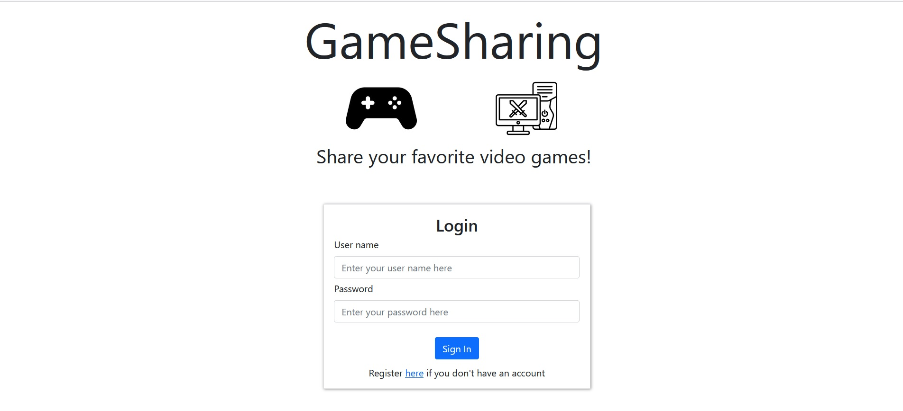
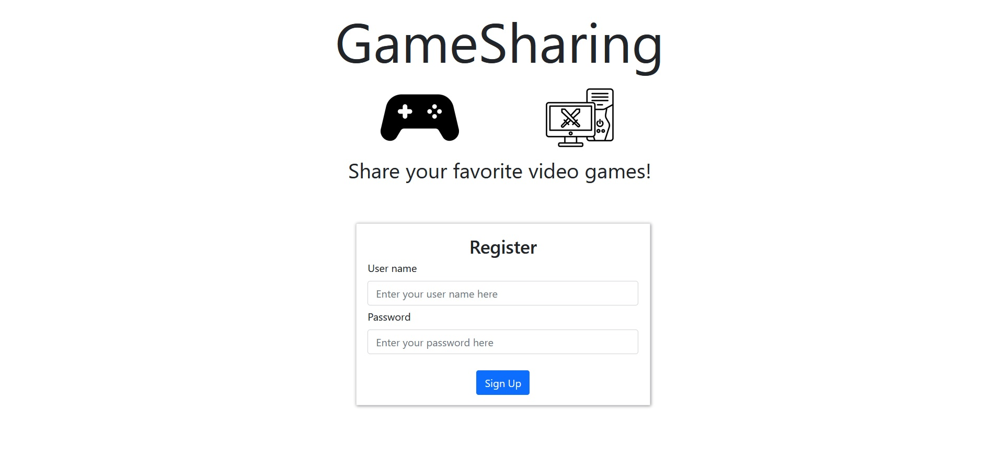
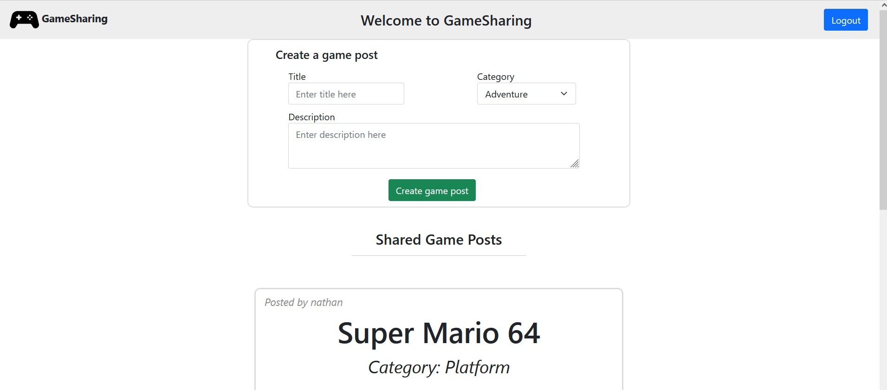
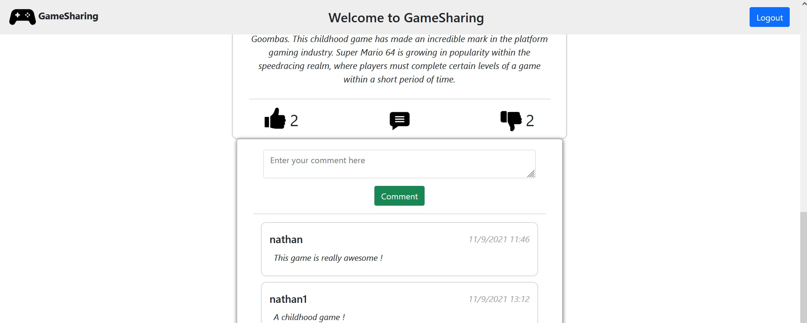

# GameSharing

This repository is for Project 2 for the CS5610 Web Development Course.

## Project Objective

The objective of this project is to create a full-stack web application (using Node, Express
MongoDB, and HTML) called GameSharing where general users or gamers can share their favorite
video games. This project is built around the idea for users or gamers to share their favorite video games and to raise discussions about their favorite video games. Users can
not only share their favorite video games through posts but can react to their own game posts as well as game posts by other users through likes, dislikes and comments. 

## Author

Nathaniel Tesfalidet

## Relevant Links

- [Class website link](https://johnguerra.co/classes/webDevelopment_fall_2021/)
- [Video demo link](https://drive.google.com/file/d/1RpudRXkNcnWsMv42LmxBTQgUpmCpW2G_/view?usp=sharing)
- [Google slides link](https://docs.google.com/presentation/d/1lx5cwo6CtErCzPB5dZGX5LxOOVJZ3LRoRY3ZrVHNP2o/edit?usp=sharing)

## Instructions

### Installation Requirements:

- Make sure to have Node.js and npm installed (along with MongoDB installed).
- Run `npm install` to install dependencies. 

### How to run project:

- Run the project by running `npm start` 

## Screenshots

